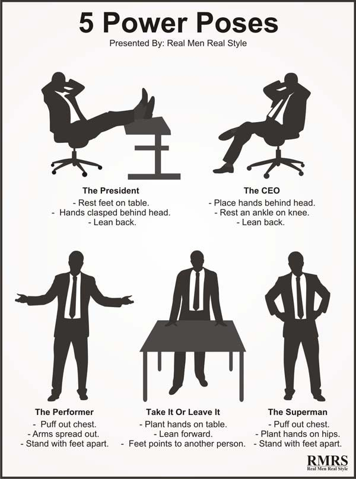

# Leadership

__What is leadership?__

Is a skill of influences. This is a skill/tools that all of us need to master. This first persone you need to influences is you. 

_Servent leadership_ where people use there thought, filings and imotion for greater goods.

Leadership is person of influences.

Vedio; [Tony Robbins on the Psychology and Skills of Exceptional Leaders](https://www.youtube.com/watch?v=mBNoUhHtmVc
)

__Power Posture__

Body expresion can change your mind. There are high posture that you can use 2 min a day that will help you improve your alpha sign.

_Fack it til you become it._

Watch this vedio; [TED: Your body language may shape who you are](https://www.ted.com/talks/amy_cuddy_your_body_language_may_shape_who_you_are/up-next?language=en)

## 21 Law

__Leadership ability determines a porson's level of effectiveness__

__The true masure of leadership is influence - nothing more, nothing less__

__Leadingship develops daily, not a day__

__Anyone can steer the ship, but it takes a leader to chart the course__

__When the real leader speaks, people listen__

__Trust is the foundation of leadership__

__People naturally follow leaders stronger than themselves__

__Leaders evaluate everything with a leadership bias__

__Who you are is Who you attract__

__Leaders touch a heart before they ask for a hand__

__A leader's potential is determined by those closest to him__

__Only secure leaders give power to others__

__It takes a leader to raise up a leader__

__People buy into the leader, then the vision__

__Leader's find a way for the team to win__

__Monemtum is a leader's best fiend__

__Leaders understand that activity is not necessarily accomplishment__

__A leader must give up to go up__

__When to lead, is a important as what to do and where to go__

__To add growth, lead followers - to multiply, lead leaders__

__A leader's lasting value is measured by succession__

## Sir Alex Ferguson

__Define organization missions and goals__

A leader must always think through the organization’s missions, goals and define them. He also believes that no one can be a leader without trusting his team or having the responsibility to encourage the team to be stronger. 

__Leader need to handel different situation__

he consider that there’s no single style of leadership, that all potential leaders will have to cope with different situations continuously and that making strategies is a priceless added value.

__Respectful__

 For him representing people is a big responsibility and the leader must never harm the image of his people, by paying attention to every single detail of his words and actions. According to him, a true leader should always impose his values, principles and beliefs so he won’t seem weak and be discarded by people. Being loyal to your follower’s is also an essential trait of leadership because it keeps them stimulated and motivated. 

__Self-confident__

 First, Alex Ferguson is self-confident, he always believed in his leadership style, by applying it in every team he managed. Also he asked the payers to believe in him even though they were not doing well at the beginning.

__Hand on__

 Alex Ferguson invest a lot of energy in everything he does, by attending every training session and getting involved in anything that might be in the interest of the team.

__Pantuality__

 He is always first in the practice session, the last one that leaves and he wants to convey this behavior to all the players. 

__Honesty and integrity__

 Alex Ferguson has also the “Honesty and integrity” trait, he has always being frank with his player and staff, he applied the rules he wants his players to observe on himself.

__Autocratic leader__

 Alex Ferguson autocratic leadership. He has an autocratic leadership first because he needs to control everything inside the club. He controls the transfers, the practice session, the hiring of staff. 

__Democratic style__

 using the democratic style from the behavioral theory would keep the players motivated and the manager will get some feedback on what he is doing and can resolve ongoing problems inside the team. He will also give details about his decision which will help some player get out of the fog and understand better what he is doing, especially when there is a Sword of Damocles on a player and his situation is unclear. 

__Path goal one__

 Theory that would help keeping the player motivated is the path goal one. It will be helpful to use it because it cares more about the player and work with him to achieve his own goal. Hence, he will be always motivated to work harder.